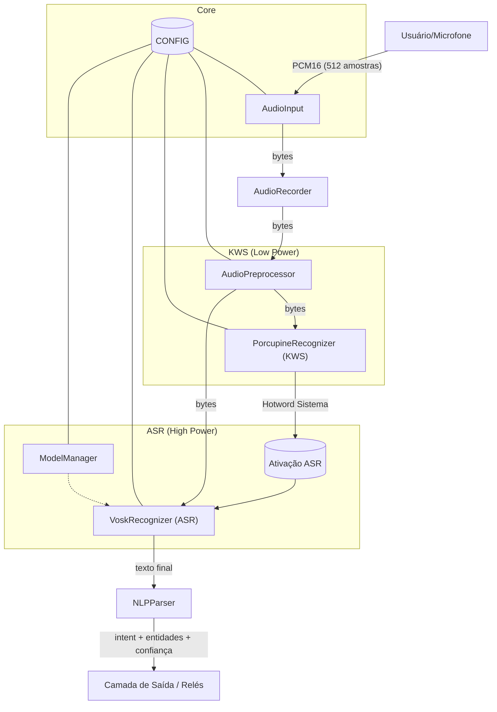
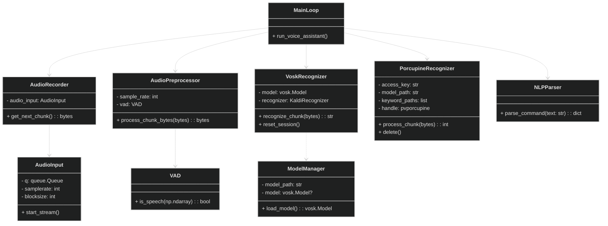
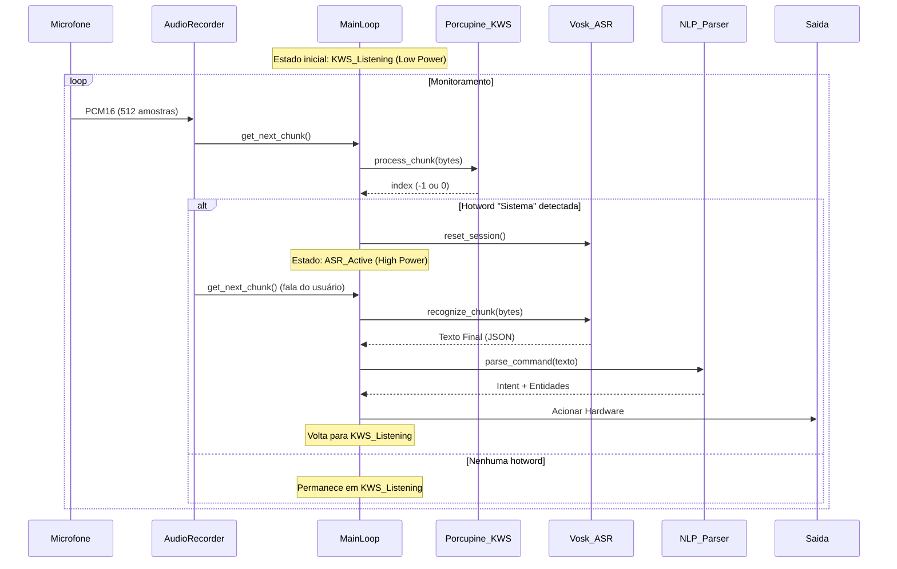
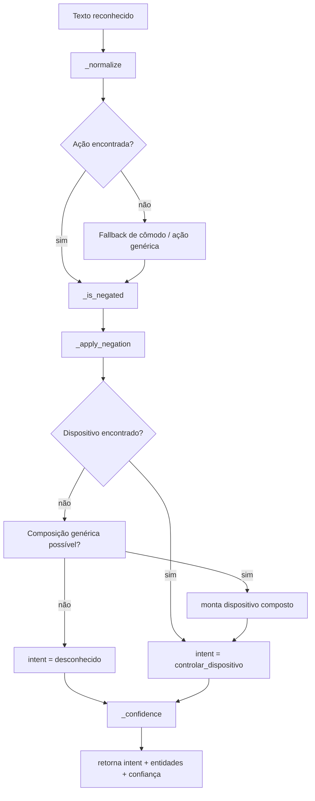
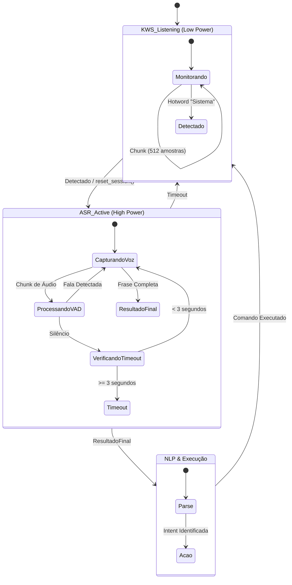

# Sistema Embarcado de Reconhecimento de Voz Offline

Documentação do projeto integrador (Engenharia de Computação – UFSM) para um pipeline completo de reconhecimento de voz offline, com captura de áudio, pré-processamento, ASR com Vosk e interpretação de comandos (NLP) baseada em regras integrando **Detecção de Hotword (KWS)** de baixo consumo.

Esta documentação descreve a arquitetura, componentes, fluxos internos, comportamento esperado do sistema e diagramas UML em Mermaid.

---

## Visão Geral do Sistema

O sistema opera totalmente offline e utiliza uma **arquitetura híbrida de ativação por voz** para otimizar o consumo de processamento:

* **Captura de áudio** em tempo real.
* **Detecção de Hotword (KWS)**: Camada de baixo consumo (*Low Power*) que monitora continuamente o áudio em busca da palavra-gatilho **"Sistema"** (usando Picovoice Porcupine).
* **Reconhecimento de fala (ASR)**: Camada de alto desempenho (*High Power*) usando modelo Vosk local, ativada **apenas** quando a hotword é detectada.
* **Pré-processamento** (normalização, VAD e adaptação de buffers).
* **Interpretação de comandos (NLP)** em português, baseada em sinônimos, regras e composição.

**Formato de dados entre módulos:** PCM16 mono (bytes), com taxa de amostragem de 16kHz e tamanho de bloco fixo de **512 amostras** (requisito de sincronia do módulo KWS).

**Formato de dados entre módulos:**  
PCM16 mono (bytes), com taxa de amostragem definida em `src/core/config.py`.

## Módulo de Detecção de Hotword (KWS)

Esta é a camada de entrada do sistema, responsável pela eficiência energética.

### Tecnologia e Arquitetura
O módulo utiliza o motor **Picovoice Porcupine**, que permite processamento *on-device* com latência mínima.
* **Estado KWS:** Monitora o áudio continuamente.
* **Gatilho:** A detecção da palavra "Sistema" dispara a transição de estado no orquestrador (`main.py`).

### Detalhes de Implementação Técnica
A integração exigiu alterações estruturais no pipeline de áudio:
* **Sincronia de Áudio:** O `BLOCKSIZE` em `src/core/config.py` foi fixado em **512 amostras** para atender aos requisitos de frame do Porcupine.
* **Compatibilidade de Idioma:** Implementação do carregamento explícito do modelo de idioma Português (`porcupine_params_pt.pv`) juntamente com o modelo da palavra-chave (`sistema_pt.ppn`) para evitar conflitos de localidade.
* **Ponte KWS ↔ ASR:** Implementação do método `reset_session()` no `VoskRecognizer` para limpar o buffer de áudio na transição de estados, evitando a transcrição duplicada da hotword.

---

## Estrutura do Código

* `src/core/config.py` — `CONFIG` (Parâmetros de áudio, chaves de acesso Picovoice, caminhos dos modelos e tamanho de bloco fixo de 512 amostras).
* `src/audio/microphone.py` — `AudioInput` (Stream de entrada usando `sounddevice`, configurado para a latência exigida pelo KWS).
* `src/audio/recorder.py` — `AudioRecorder` (Consome fila do microfone).
* `src/audio/preprocessor.py` — `AudioPreprocessor` (Resample, normalização e VAD).
* **`src/recognition/porcupine_recognizer.py`** — **`PorcupineRecognizer`** (módulo KWS que encapsula a biblioteca Picovoice para detectar a hotword "Sistema").
* `src/recognition/vosk_recognizer.py` — `VoskRecognizer` (Motor ASR; inclui o método `reset_session` para limpar o buffer na transição de estados).
* `src/recognition/model_manager.py` — `ModelManager` (Carrega `vosk.Model` localmente).
* `src/nlp/keys.py` — Dicionários de sinônimos e regras (ações, dispositivos, cômodos, negação, composição).
* `src/nlp/nlp.py` — Parser de comandos (`parse_command`).

---

## Diagrama de Componentes (UML)



---

## Diagrama de Classes (UML)



---

## Diagrama de Sequência: Fluxo em Tempo Real



#### `_confidence(has_action: bool, has_device: bool, text: str) -> float`

- Calcula uma confiança heurística acumulando pontos:
  - +0.5 se encontrou uma **ação**.
  - +0.4 se encontrou um **dispositivo**.
  - +0.05 se encontra palavras de cortesia / reforço ("por favor", "agora", "imediatamente"...).
  - +0.05 se identifica formas verbais típicas de comando ("abra", "feche", "ligue"...).
  - +0.05 se há valor numérico com `%` ou graus.
  - +0.05 se foi identificado um **cômodo**.
- O valor final é **limitado entre 0.0 e 1.0**.

### Função Principal: `parse_command(text: str) -> Dict[str, Any]`

Esta é a função de alto nível usada pelo restante do sistema. Fluxo simplificado:

1. **Normalização do texto**
   - `norm = _normalize(text)`
   - Torna o texto adequado para buscas por sinônimos.
2. **Identificação de ação e dispositivo específicos**
   - `action = _find_best_match(norm, ACTIONS)`
   - `device = _find_best_match(norm, DEVICES)`
   - Marca `has_action` e `has_device` com base nos resultados.
3. **Tratamento de negação**
   - `neg = _is_negated(" " + norm + " ")` (adiciona espaços para facilitar regex).
   - Extrai `action_key` da tupla de ação (se houver) e chama `_apply_negation`.
4. **Fallback para dispositivos genéricos + cômodo**
   - Se nenhum dispositivo específico for encontrado:
     - Busca um **dispositivo genérico** com `_find_generic_device` (ex.: `"luz"`).
     - Busca um **cômodo** com `_find_room` (ex.: `"sala"`).
     - Se o genérico estiver em `COMPOSABLE` e houver cômodo, compõe uma chave como `"luz_sala"`.
5. **Definição da intent**
   - Se houver ação e dispositivo válidos, usa `INTENT_DEFAULT` (ex.: `"controlar_dispositivo"`).
   - Caso contrário, define intent como `"desconhecido"`.
6. **Montagem do resultado base**
   - Estrutura retornada:
   - `"intent"`: string com o nome da intent.
   - `"entities"`: dicionário com pelo menos:
     - `"acao"`: chave normalizada da ação (ou `None`).
     - `"dispositivo"`: chave normalizada do dispositivo (ou `None`).
   - `"confidence"`: valor float calculado por `_confidence`.
7. **Enriquecimento com valor numérico**
   - Chama `_extract_value(norm)`.
   - Se houver resultado, adiciona em `entities`:
     - `"valor"`: número extraído.
     - `"unidade"`: `%` ou `"graus"`.
8. **Retorno final**
   - Retorna o dicionário completo, pronto para ser consumido pela camada de saída / automação.

Exemplo de saída típica:

```json
{
  "intent": "controlar_dispositivo",
  "entities": {
    "acao": "ligar",
    "dispositivo": "luz_sala",
    "valor": 50.0,
    "unidade": "%"
  },
  "confidence": 0.95
}
```

### Diagrama de Atividade: Interpretação de Comandos (NLP)



---

## Diagrama de Estados: Comportamento do Reconhecedor



---

## Comportamento Esperado do Sistema

* Resistência a ruído leve via redução opcional de ruído + normalização + AGC.
* Filtro passa-faixa (80–8000 Hz, quando SciPy disponível).
* VAD evita processar regiões sem voz, reduzindo custos e falsos positivos.
* **Detecção de Hotword ("Sistema")** mantém o ASR em espera, ativando o reconhecimento apenas quando necessário.
* **Processamento em chunks de 512 amostras** para compatibilidade estrita com o motor de Hotword.
* Vosk deve operar na taxa configurada (`CONFIG["audio"]["samplerate"]`), padrão **16 kHz**.
* `recognize_chunk()` retorna resultado **final do segmento** quando `AcceptWaveform()` é verdadeiro.
* `recognize_stream()` concatena parciais + finais ao longo da fala.
* NLP retorna estrutura:

```json
{
  "intent": "str",
  "entities": {
    "acao": "...",
    "dispositivo": "...",
    "valor": "...?",
    "unidade": "...?"
  },
  "confidence": 0.0
}
```

---

## Requisitos e Setup

* Python 3.8+
* Dependências em `requirements.txt`
* Modelo Vosk em `models/vosk-model-small-pt-0.3/`
* Modelos Picovoice em `models/picovoice/`
  (configurável em `src/core/config.py`)

Instalação:

```bash
python -m venv venv
source venv/bin/activate   # Linux/macOS
./venv/Scripts/activate    # Windows
pip install -r requirements.txt
```

Estrutura mínima:

```
models/
  vosk-model-small-pt-0.3/
  picovoice/
src/
  audio/
  core/
  recognition/
  nlp/
```

---

## Execução (exemplo de orquestração)

```python
from src.audio.microphone import AudioInput
from src.audio.recorder import AudioRecorder
from src.audio.preprocessor import AudioPreprocessor
from src.recognition.model_manager import ModelManager
from src.recognition.vosk_recognizer import VoskRecognizer
from src.nlp.nlp import parse_command

audio_in = AudioInput()
pre = AudioPreprocessor()
mm = ModelManager()
model = mm.load_model()
asr = VoskRecognizer(model)

with audio_in.start_stream():
    rec = AudioRecorder(audio_in)

    processed = pre.process_stream_generator(
        (rec.get_next_chunk() for _ in iter(int, 1))
    )

    text = asr.recognize_stream(processed)
    result = parse_command(text)
    print(result)
```

---

## Testes

```bash
python -m pytest -v tests/
```

---

## Notas e Limitações

* Recursos opcionais dependem de: `noisereduce`, `webrtcvad`, `scipy`.
* Se ausentes, há fallback para implementações simplificadas.
* O módulo `output` é apenas um placeholder; a integração real com atuadores depende do hardware embarcado.

---

## Licença

Projeto acadêmico para fins educacionais (todos os direitos reservados, exceto uso acadêmico).

---
