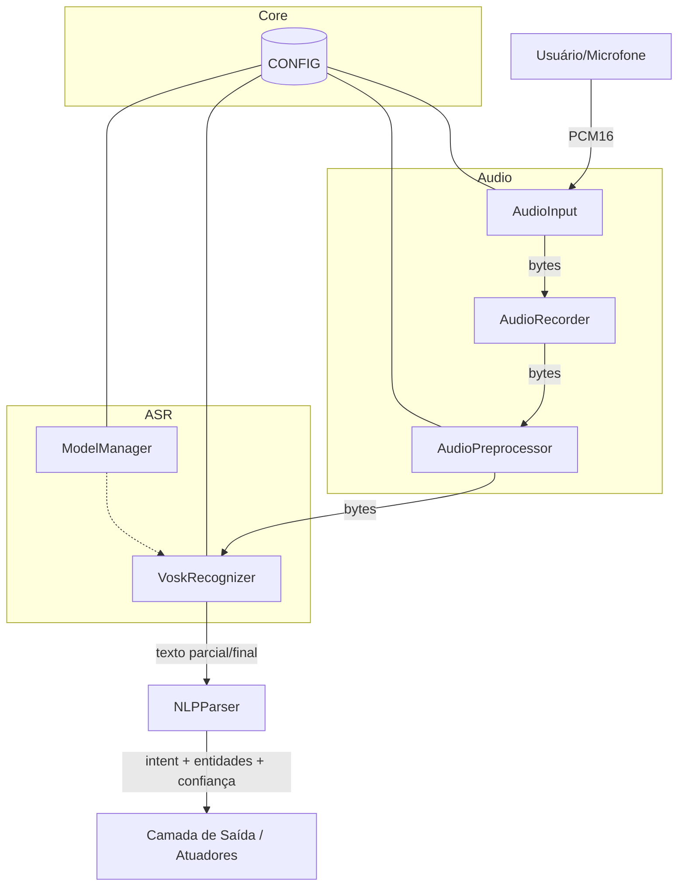
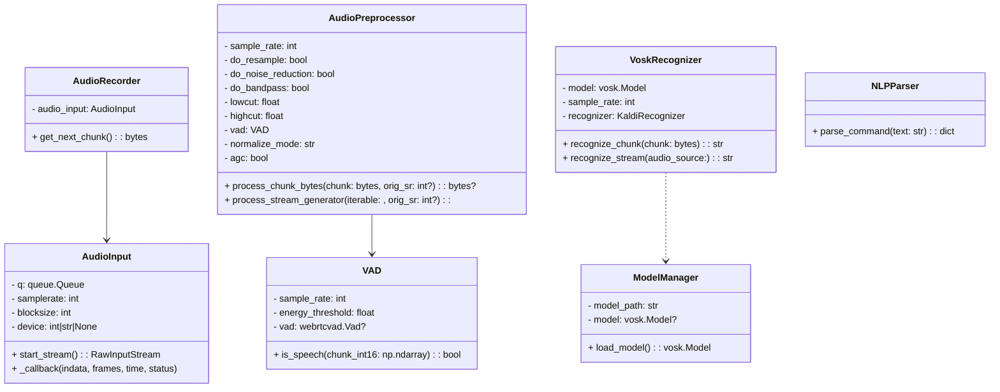
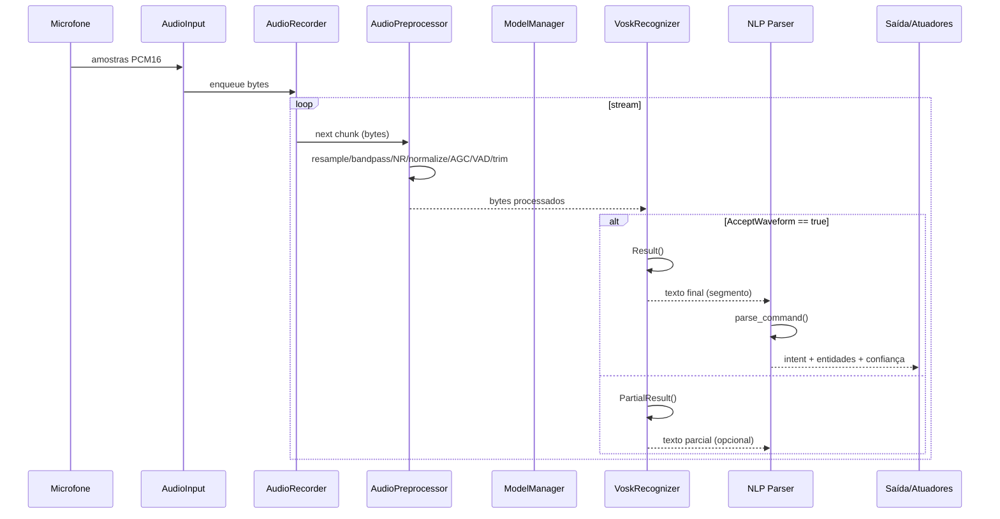
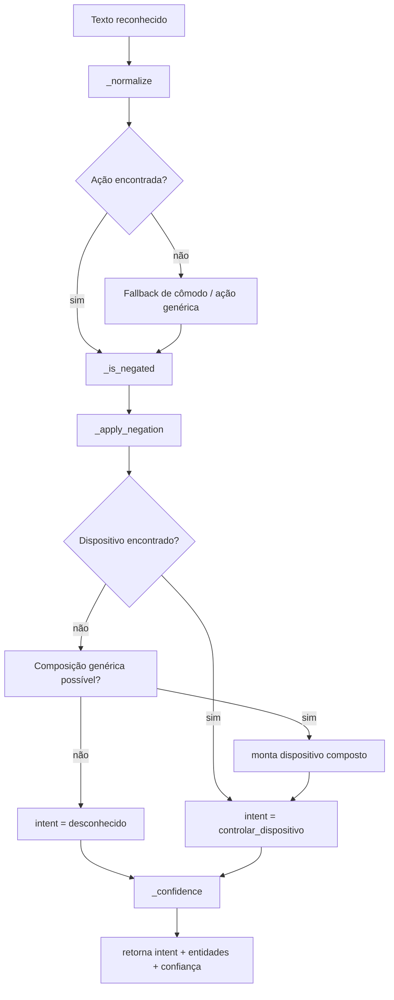
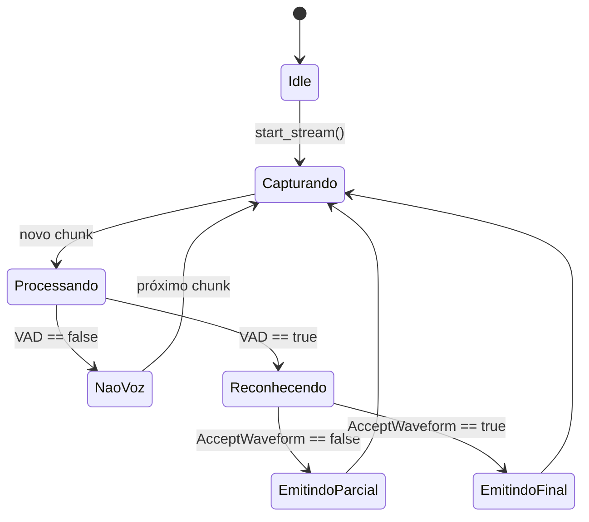

# Sistema Embarcado de Reconhecimento de Voz Offline

Documentação do projeto integrador (Engenharia de Computação – UFSM) para um pipeline completo de reconhecimento de voz offline, com captura de áudio, pré-processamento, ASR com Vosk e interpretação de comandos (NLP) baseada em regras.

Esta documentação descreve a arquitetura, componentes, fluxos internos, comportamento esperado do sistema e diagramas UML em Mermaid.

---

## Visão Geral do Sistema

O sistema opera totalmente offline e é estruturado em camadas independentes:

* **Captura de áudio** em tempo real.
* **Pré-processamento** (normalização, redução de ruído, filtro passa-faixa, VAD, trim de silêncio).
* **Reconhecimento de fala (ASR)** usando modelo Vosk local.
* **Interpretação de comandos (NLP)** em português, baseada em sinônimos, regras e composição.

**Formato de dados entre módulos:**  
PCM16 mono (bytes), com taxa de amostragem definida em `src/core/config.py`.

---

## Estrutura do Código

* `src/audio/microphone.py` — `AudioInput` (stream de entrada usando sounddevice; fila de chunks).
* `src/audio/recorder.py` — `AudioRecorder` (consome fila do microfone).
* `src/audio/preprocessor.py` — `AudioPreprocessor` (resample, bandpass, redução de ruído opcional, normalização, AGC, VAD, trim e framing).
* `src/recognition/model_manager.py` — `ModelManager` (carrega `vosk.Model` localmente).
* `src/recognition/vosk_recognizer.py` — `VoskRecognizer` (ASR por chunk ou stream).
* `src/nlp/keys.py` — dicionários de sinônimos e regras (ações, dispositivos, cômodos, negação, composição).
* `src/nlp/nlp.py` — parser de comandos (`parse_command`).
* `src/core/config.py` — `CONFIG` (parâmetros de áudio e caminho do modelo Vosk).

---

## Diagrama de Componentes (UML)



---

## Diagrama de Classes (UML)



---

## Diagrama de Sequência: Fluxo em Tempo Real



---

## Diagrama de Atividade: Interpretação de Comandos (NLP)



---

## Diagrama de Estados: Comportamento do Reconhecedor



---

## Comportamento Esperado do Sistema

* Resistência a ruído leve via redução opcional de ruído + normalização + AGC.
* Filtro passa-faixa (80–8000 Hz, quando SciPy disponível).
* VAD evita processar regiões sem voz, reduzindo custos e falsos positivos.
* Vosk deve operar na taxa configurada (`CONFIG["audio"]["samplerate"]`), padrão **16 kHz**.
* `recognize_chunk()` retorna resultado **final do segmento** quando `AcceptWaveform()` é verdadeiro.
* `recognize_stream()` concatena parciais + finais ao longo da fala.
* NLP retorna estrutura:

```json
{
  "intent": "str",
  "entities": {
    "acao": "...",
    "dispositivo": "...",
    "valor": "...?",
    "unidade": "...?"
  },
  "confidence": 0.0
}
```

---

## Requisitos e Setup

* Python 3.8+
* Dependências em `requirements.txt`
* Modelo Vosk em `models/vosk-model-small-pt-0.3/`
  (configurável em `src/core/config.py`)

Instalação:

```bash
python -m venv venv
source venv/bin/activate   # Linux/macOS
./venv/Scripts/activate    # Windows
pip install -r requirements.txt
```

Estrutura mínima:

```
models/
  vosk-model-small-pt-0.3/
src/
  audio/
  core/
  recognition/
  nlp/
```

---

## Execução (exemplo de orquestração)

```python
from src.audio.microphone import AudioInput
from src.audio.recorder import AudioRecorder
from src.audio.preprocessor import AudioPreprocessor
from src.recognition.model_manager import ModelManager
from src.recognition.vosk_recognizer import VoskRecognizer
from src.nlp.nlp import parse_command

audio_in = AudioInput()
pre = AudioPreprocessor()
mm = ModelManager()
model = mm.load_model()
asr = VoskRecognizer(model)

with audio_in.start_stream():
    rec = AudioRecorder(audio_in)

    processed = pre.process_stream_generator(
        (rec.get_next_chunk() for _ in iter(int, 1))
    )

    text = asr.recognize_stream(processed)
    result = parse_command(text)
    print(result)
```

---

## Testes

```bash
python -m pytest -v tests/
```

---

## Notas e Limitações

* Recursos opcionais dependem de: `noisereduce`, `webrtcvad`, `scipy`.
* Se ausentes, há fallback para implementações simplificadas.
* O módulo `output` é apenas um placeholder; a integração real com atuadores depende do hardware embarcado.

---

## Licença

Projeto acadêmico para fins educacionais (todos os direitos reservados, exceto uso acadêmico).

---
